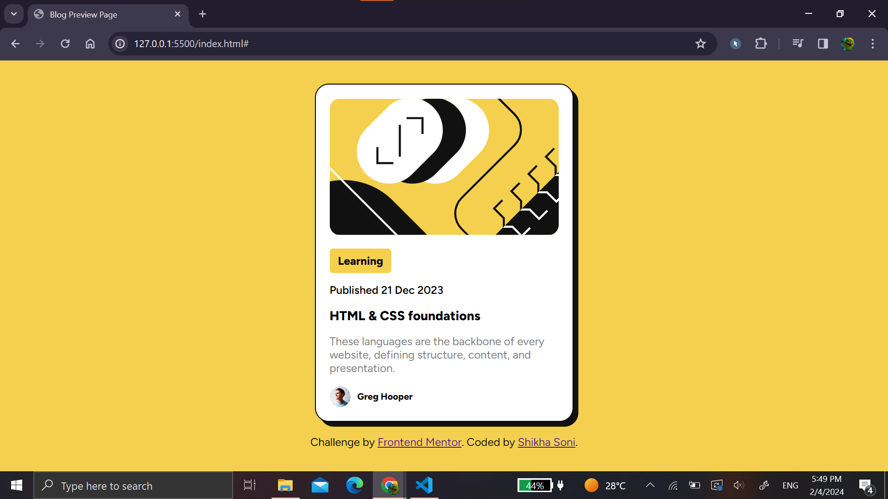
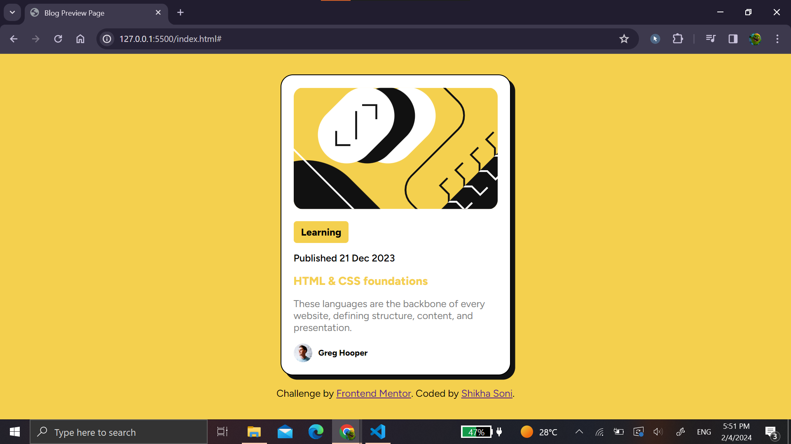
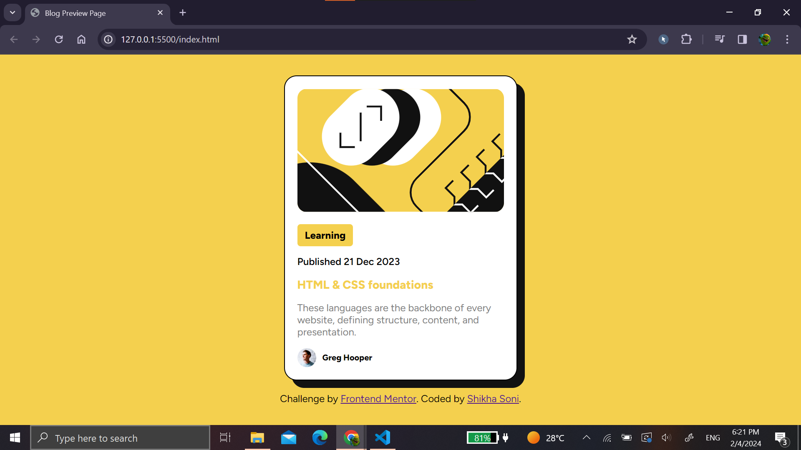

# Frontend Mentor - Blog preview card solution

This is a solution to the [Blog preview card challenge on Frontend Mentor](https://www.frontendmentor.io/challenges/blog-preview-card-ckPaj01IcS).

## Overview

This project involves creating a blog preview card page using HTML and CSS. The focus is on responsive design, styling, and incorporating key web development concepts.

### The challenge

Users should be able to:

- See hover and focus states for all interactive elements on the page

### Screenshot

Blog Card Preview :

Blog Card on hovering :

Blog Card active state :

### Links

- Live Site URL: [Live site URL here](https://fmss-blog-card-preview.netlify.app/)

## My process

### Built with

- HTML
- CSS properties
- Flexbox

### What I learned

In this project, I gained hands-on experience in:

- Structuring HTML
- Styling with CSS, including responsive design
- Utilizing Google Fonts for typography

### Useful resources

- [Google Fonts](https://fonts.google.com/)

## Author

- Frontend Mentor - [@shikha-soni-23](https://www.frontendmentor.io/profile/shikha-soni-23)
